Overview
========

This document describes steps required to develop and deploy a C\# IoT Edge
custom module to your Raspberry Pi device and make use of its camera module to
send photo to IoT Hub every 3 seconds.

We usually do not send photo to cloud every certain seconds as it incurs extra
costs. The purpose of document is meant to provide an instruction on how to
create a module that able to access to Raspberry Pi hardware. In real-world
scenario, you may consider of doing analysis on the edge and only send
information of interests to the cloud.

Reference
=========

-   <https://stackoverflow.com/questions/47872218/how-to-specify-device-option-for-docker-run-command?rq=1>

-   <https://www.raspberrypi.org/forums/viewtopic.php?t=202343>

-   <https://blog.alexellis.io/dotnetcore-on-raspberrypi/>

Prerequisites
=============

We assume you have basic knowledge and has setup below services on Azure

-   Azure IoT Hub
-   Installed Azure IoT Edge runtime in your development environment
    -   If haven’t installed & setup, follow this instruction to prepare your
        development machine:
        <https://docs.microsoft.com/en-us/azure/iot-edge/tutorial-csharp-module>
-   A Raspberry Pi 3 board with Raspbian
-   Set IoT Edge runtime on your Raspberry Pi device
    -   Follow this instruction to setip IoT Edge runtime on Raspberry Pi: https://docs.microsoft.com/en-us/azure/iot-edge/tutorial-simulate-device-linux#install-and-start-the-iot-edge-runtime
-   A Docker Hub account

Create IoT Edge Module for RPi
==============================
### Develope a C# Module ###

#### Complete source code [here](https://github.com/michael-chi/iot-edge-cv/tree/master/src/lab1)

-   On your development environment, execute below command to create a new Azure
    IoT Edge C\# module project

-   dotnet new aziotedgemodule -n CameraModule2

-   In this lab, we are using package created by [Unosquare
    lab](https://github.com/unosquare) to access Raspberry Pi hardware.

-   Add below line to your .csproj file
```xml
<PackageReference Include="Unosquare.Raspberry.IO" Version="0.13.0" />
```
    -   Your .csproj should looks like below
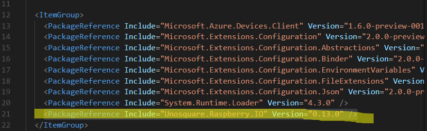
-   Add namespace using to your Program.cs 
```csharp 
#define IOT_EDGE

namespace CameraModule2 
{ 
//...Ommitted

using Unosquare.RaspberryIO;
using Unosquare.RaspberryIO.Camera;
using Unosquare.RaspberryIO.Computer;
using Unosquare.RaspberryIO.Gpio;
```
-   Add CaptureImage function to take photo
```csharp
    static List<Task> tasks = new List<Task>();
    static bool running = true;
    private async static void CaptureImage(DeviceClient iotHubModuleClient)
    {
        try{
            counter ++;
            Console.WriteLine("Opening Camera...");

            var pictureBytes = Pi.Camera.CaptureImageJpeg(640,480);
            Console.WriteLine("Here...");
            var msg = new Message(pictureBytes);
#if IOT_EDGE
            await iotHubModuleClient.SendEventAsync("cameraOut", msg);
#else
            await iotHubModuleClient.SendEventAsync(msg);
#endif
        }
        catch(Exception exp){
            Console.WriteLine($"Exception:{exp.Message}");
            Console.WriteLine($"==> :{exp.StackTrace}");
            if(exp.InnerException != null){
                Console.WriteLine($"InnerException:{exp.Message}");
                Console.WriteLine($"==> :{exp.StackTrace}");
            }
        }
    }
```
-   In UpdateFromTwin(), whenever receives an desired property update event, invoke Start(), in which we will setup CaptureImage() timer.
```csharp
    private static async Task UpdateFromTwin(TwinCollection desired, DeviceClient iotHubModuleClient)
    {
        if (desired != null)
        {
            foreach (var property in desired)
            {

            }
        }
#if IOT_EDGE
        await iotHubModuleClient.SetInputMessageHandlerAsync(
            "input",
            PipeMessage,
            iotHubModuleClient
            );
#else
        await iotHubModuleClient.GetTwinAsync();
#endif
        tasks.Add(Start(iotHubModuleClient));//Add a task reference
    }
    static async Task Start(DeviceClient iotHubModuleClient)
    {
        running = true;
        while (running){
            CaptureImage(iotHubModuleClient);
            await Task.Delay(1000 * 3);
        }
    }
```

-   Create a new file named “Dockerfile.camera”

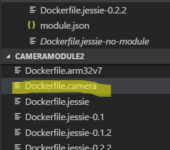

-   Add below codes to Dockerfile.camera
```
FROM resin/rpi-raspbian:jessie as runtime-env

### Tools setup

RUN apt-get update && apt-get -y install sudo
RUN apt-get upgrade -y
RUN apt-get install gnupg gnupg2 -y
RUN echo "deb http://archive.raspberrypi.org/debian/ jessie main" >>/etc/apt/sources.list
RUN apt-get install -y wget
RUN apt-get install libraspberrypi-bin -y --allow-unauthenticated
RUN usermod -a -G video root

### Install .net core 2.0 sdk ###
RUN apt-get install -y curl libunwind8 gettext
RUN curl -sSL -o dotnet.tar.gz
https://dotnetcli.blob.core.windows.net/dotnet/Runtime/release/2.0.0/dotnet-runtime-latest-linux-arm.tar.gz
RUN mkdir -p /opt/dotnet && sudo tar zxf dotnet.tar.gz -C /opt/dotnet
RUN ln -s /opt/dotnet/dotnet /usr/local/bin

### Build C\# Module
FROM microsoft/dotnet:2.0-sdk AS build-env
RUN mkdir /app
WORKDIR /app
COPY \*.csproj ./
RUN dotnet restore
COPY . ./
RUN dotnet publish -c Release -o out

### Deploy and Configure IoT Edge Module
FROM runtime-env
WORKDIR /app
COPY --from=build-env /app/out ./
ENTRYPOINT ["dotnet", "CameraModule2.dll"]
```

- Explain of the docker file
    1. We start from basic Jessie image and installed required package including raspistill which will be used in our C\# module.
    2. We then use to official build environment for Raspberry Pi and build our module. AS of today, Raspberry Pi can only be the deployment target (not development target)
- Now edit module.json, add below line to your module.json file
```json
"camera":"/Dockerfile.camera"
```
-   your file should looks like below
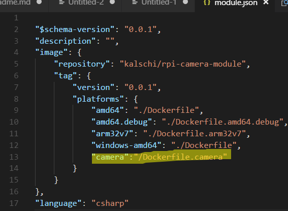
-   Right click on your module.json, build and publish your image to docker hub.
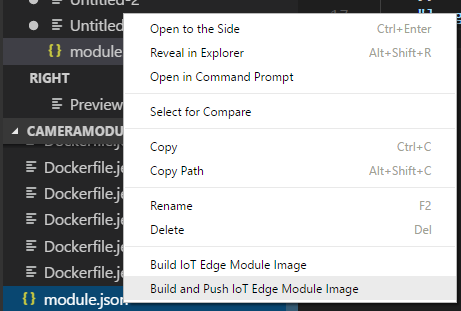

-   When prompted, select "camera"
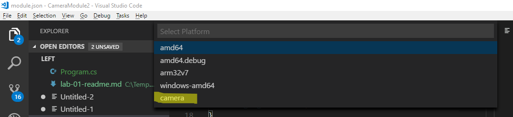
-   Your module should now be compile and push to docker hub.
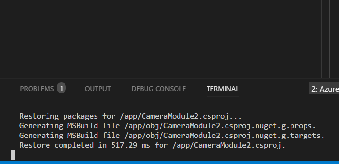
-   Once pushed, go to your Docker Hub to confirm it is pushed and note down docker image name and tag.
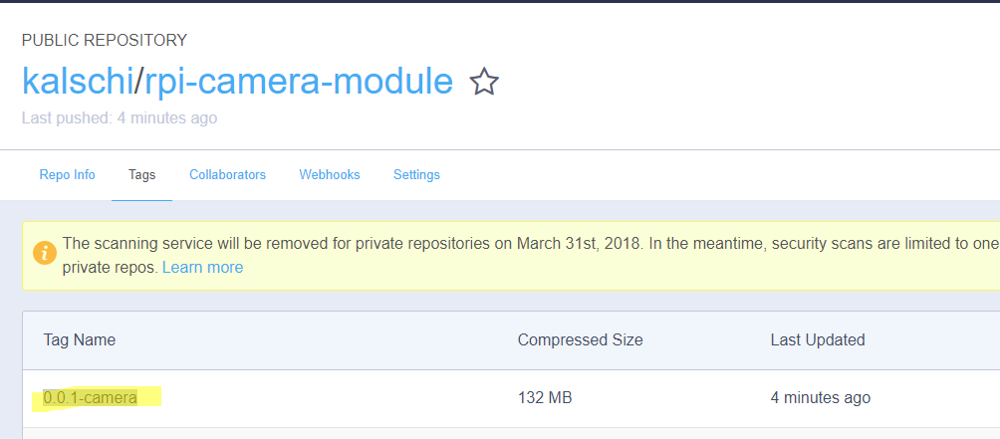

### Set up device twin ###
-   Goto Azure portal, open IoT Hub management console.
-   If not yet created, create a new IoT Edge device for your Raspberry Pi device and open its configuration page.

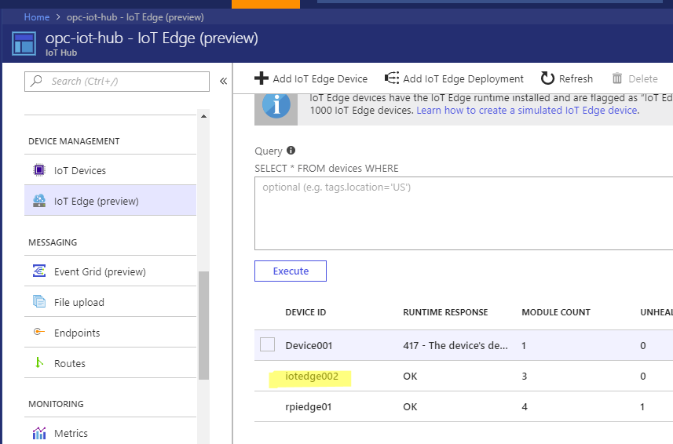
-   Go to Device Twin

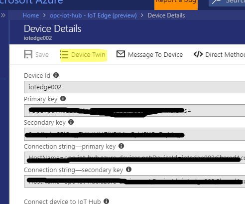
-   In this lab, we will add a Tag with name "type" and value "camera" to our device

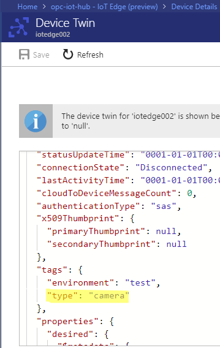
-   Save Device Twin setting.
-   Go back to IoT Edge page, create a new Deployment
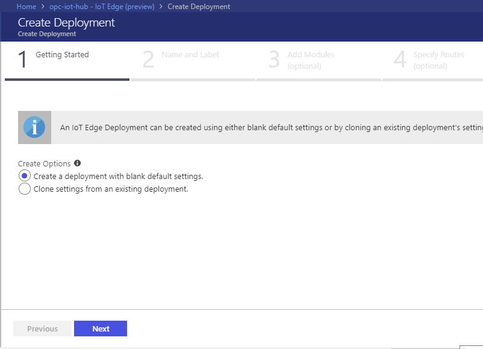
-   Name this deployment
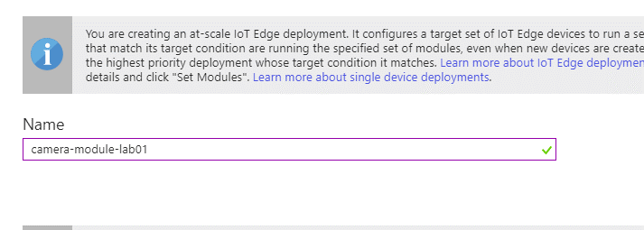
-   Add an IoT Edge module
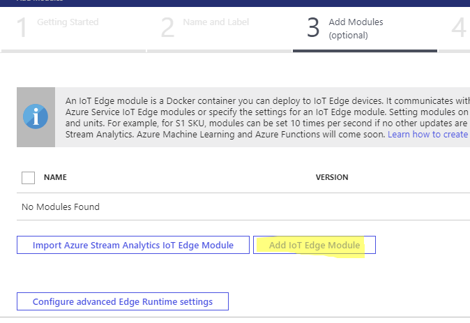
-   Update module's container creation option with below codes. Below configuration tells container runtime on Raspberry Pi to map /dev/vchiq, /dev/mem and /dev/gpiomem to container; and give container priviledged access.
```json
{
    "HostConfig": {
    "Priviledged" : true,
    "Devices": [
        {
            "PathOnHost": "/dev/vchiq",
            "PathInContainer": "/dev/vchiq",
            "CgroupPermissions": "rwm"
        },
        {
            "PathOnHost": "/dev/mem",
            "PathInContainer": "/dev/mem",
            "CgroupPermissions": "rwm"
        },
        {
            "PathOnHost": "/dev/gpiomem",
            "PathInContainer": "/dev/gpiomem",
            "CgroupPermissions": "rwm"
        }
    ]
    }
}
```
-   Update Container image repository URL nad give the module a name
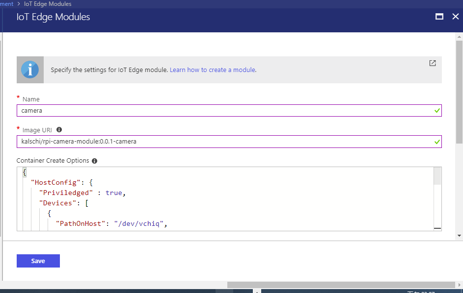
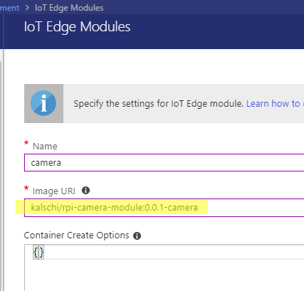
-   Click Next, accept default Routes setting
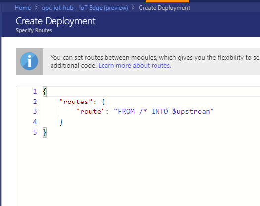
-   In Target Conditions filed, fill in below condition. This tells IoT Hub only IoT Edge Device has "type" tag set to "camera" will apply this deployment.
```
tags.type='camera'
```
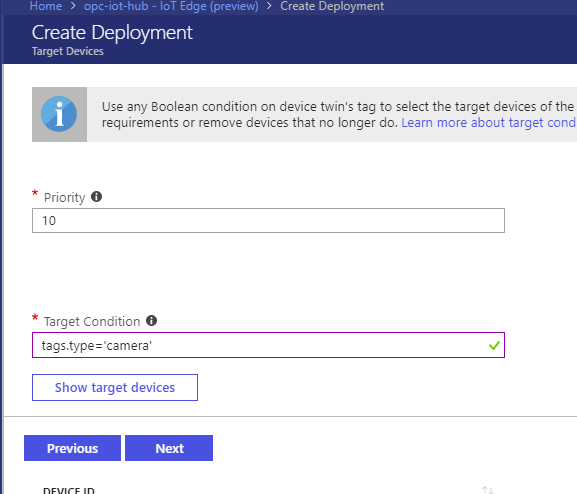
-   Next and Submit Deployment
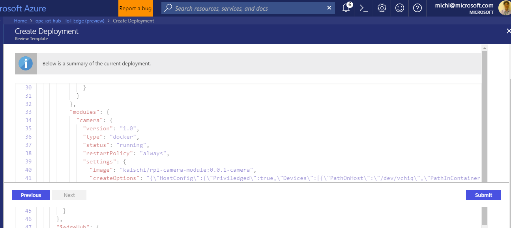
-   Wait for new deployment gets deployed to your Raspberry Pi device, you should see camera module installed in your Raspberry Pi flashes every certain seconds.


